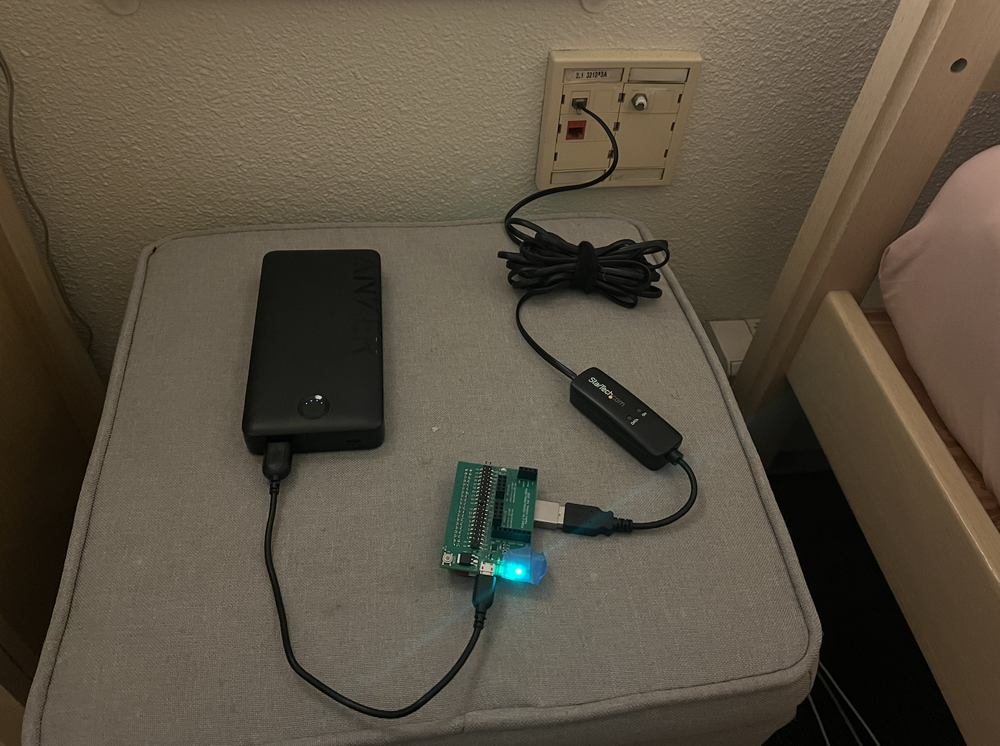

# Final Project for CS140e: Breaking into Lyman
*By: Jacob Roberts-Baca (jtrb) and Yasmine Alonso (yalonso)*

## Overview
Have you ever been locked out of your building at 3am without your ID and didn't want to have to call a friend to wake them up to have them let you in? This project is for you!

Most (all?) Stanford buildings allow people to call any resident from the front door via the landline that we have in our rooms. If the resident dialed picks up, and presses 9, the building unlocks. Our goal for the project was to automate this pickup/dial 9 process so that we always have the option to get into our building in the case of a lockout. You can find all the code in this repo.

Take a look at a skit demo video of our project in action [here](youtube.com/watch?v=qMFVxF3Dywc&feature=youtu.be)!
And [here](https://youtu.be/A7pM5v7Wlb0) is a view into the AT commands/responses that are sent/received by the Pi through the modem (if connected to a laptop and can send this over UART). Our slides from our presentation can be viewed [here](https://office365stanford-my.sharepoint.com/:p:/g/personal/yalonso_stanford_edu/IQCXLsSwK1hyTpUtikpJ8OeAAcfXLR2-sWrSOVVw9kGk5OE?e=2WUH6b).

## Usage
Getting the code (two options):
- Copy paste the `140e-final-proj` directory into your 140e repository (I kept it in my `/labs` folder)
OR
- Clone the repo and change your `CS140E_2026_PATH` env variable to point towards this repo. e.g. in .zshrc I added `export CS140E_2026_PATH="/Users/yasminealonso/cs140e_home/140e-final-proj/"`

Running the program:
- Run `make` in `code/`. This will produce `door_unlock_script.bin`.
- Then, simply run `pi-install app/door_unlock_script.bin`. 

Note: if you want to not have to hook this up to your laptop, you can provide power to the Pi via a power bank or some other source. Take the SD card out of your pi, and replace `kernel.img` with the door unlock binary. Rename the door unlock binary `kernel.img`. Now, when you put the SD card back in the pi, this door unlock binary will be the first thing to run as soon as the Pi is connected to power. So you can just leave the pi connected to the wall + the power bank and not have to sacrifice your laptop :-)
 
Below is an image of our setup, with the Pi connected to a portable charger for power. 
Power bank --> Pi --> StarTech Modem --> Landline port 

## Device Information
We purchased the [StarTech.com 56K USB Dial-up & Fax Modem](https://www.amazon.com/StarTech-com-56K-USB-Dial-up-Modem/dp/B01MYLE06I/ref=sr_1_3?adgrpid=186021838763&dib=eyJ2IjoiMSJ9.lOJFuKbl03QJ-b8_dLbA5NXidxTwK6leb7jUiJoYlaSd_dUE94DD7mpQcyeycpGeqLbOnP1CrJP1OzI3cjTgVVKRI1UwIhmBumshoiOpNvg2eirTV-xI_Fxb8i5DtLFVOjQk2EZz9HHD2Sv2hqipOnoGQ6KBCT34Gw_13Dq198yKg6vLdmqFuGmE8NA8GgFP88Z8QQiBFGoB-UbqWHNljAWATzQbbJciq0K4jWohBV4.MRYsZAyG5VYTQs6eqbouZAPLQpWQm2AI6dITGzoVOg0&dib_tag=se&hvadid=779581331944&hvdev=c&hvexpln=0&hvlocphy=9031915&hvnetw=g&hvocijid=6400171205119250179--&hvqmt=b&hvrand=6400171205119250179&hvtargid=kwd-325685945691&hydadcr=24139_13533938_2335427&keywords=startech+usb+fax+modem&mcid=f4f95e7e5b8b3dbbb3c93d3d9d484415&qid=1773169012&sr=8-3) off of Amazon which allows us to send/receive commands (pick up phone, dial 9, hang up phone, etc.) to masquerade our Pi as a telephone.

Simply plugging this device into a computer (laptop, Raspberry Pi) and then into the landline port in your room allows you to make and receive phone calls and communicate other relevant information via AT commands, a set of text instructions that can be used to control modems, cellular modules, and IoT devices! Read more about AT commands [here](https://onomondo.com/blog/at-commands-guide-for-iot-devices/) and also [on Wikipedia](https://en.wikipedia.org/wiki/Hayes_AT_command_set). We also explain a bit more about the relevant commands them below in our application section. 

Relevant documentation:
- [Modem datasheet](https://media.startech.com/cms/pdfs/usb56kemh2_datasheet.pdf?_gl=1*1wx31al*_gcl_au*Njg4MjI3MjI0LjE3NzMxNzExNzU.*_ga*MTc5NzI3ODUwLjE3NzMxNzExNzU.*_ga_YXX1RSJGSC*czE3NzMxNzExNzQkbzEkZzEkdDE3NzMxNzE1NjUkajYwJGwwJGgxOTY0MzgzMDgy). Doesn't have much information.
- [Conexant CX93010-2x Datasheet](https://datasheet.octopart.com/CX93010-22Z-Conexant-datasheet-180221437.pdf). This is the chip that powers the modem. Has helpful information about voice/fax classes.
- [Modem product listing](https://www.startech.com/en-us/networking-io/usb56kemh2?srsltid=AfmBOop4A9Q6g-aUonfiW6FAP7FHi1NitRrnLda2GFplWlGbtjo3gUif). The technical specifications portion of this made us feel decently confident pre-purchasing that our idea would work, as it says it supports DTMF (Dual Tone Multi Frequency, not the bad bunny song) signaling.

## Application 
Our application that controls the modem from the Pi performs an infinite loop of the following: 
- Initialize the modem via the following commands:
    - `AT&F`: Hard reset the state of the modem
    - `ATE0`: Disables echoing of all output
    - `ATH`: Hang up the phone to ensure we're in a hung-up state
    - `ATS0=1`: Enable auto-pickup after 1 ring
    - `AT+FCLASS=8`: Set modem into voice mode (required for DTMF tones)
    - `AT+VLS=0`: Voice line select -- tell modem how transmit/receive audio should be routed
- Play a little jingle (via sending `AT+VTS` commands of various frequencies) to indicate to the user that it's time to enter the passcode
- Receive entered tones/numbers from the user, keeping track of them in a buffer
- If the inputted passcode matches the secret passcode, send `AT+VTS=9` (a 9 dial tone) to unlock the door
- If it doesn't, hang up, and the user can try again.

If you're curious about how it works, we have a python implementation available too (see: `python/script.py`) which might be easier to get a fast understanding of how the application works! 

## The USB stack
First, a massive thank you to Tianle Yu for his [documentation on building a USB Host Stack for DWC2](https://sites.tianleyu.com/~unics/cs140e/usb.md)! Without him, this would have not been possible!

The modem we use needs to communicate with the Pi over USB, which we do not currently have the support for. So, we needed to build a driver and a USB host stack for the DWC2 controller (hardware component inside the broadcom that allows us to send USB information). Implementing this gave us the OSey part of our project that we needed.

==== Highest Level ====
- `app/door_unlock_script.c` implements the main application (described above) that can be run on the pi to constantly keep an eye out for calls to the landline + unlock the door. 
- `usb/cdc_acm.c` implements the driver that allows the Pi to treat the modem as a serial port. Exposes the `cdc_read()` and `cdc_write()` functions which are used to communicate with the modem over USB (e.g. sending and receiving `AT` commands).
    - Helpful documentation for this part:
        - [Universal Serial Bus Class Definitions for Communications Devices](https://www.usb.org/document-library/class-definitions-communication-devices-12). Download the zip linked here to get the PDF for errata/docs 
- `usb/usb_core.c` We use functions here in our application code to initialize the modem device: figure out that it exists, give it an address, configure it, and figure out what endpoints the modem has available. A critical assumption made by the functions here (specifically the `usb_enumerate()` function which discovers the modem device connected via USB) are that there is **only a single USB device connected to the Pi**. This simplifying assumption made our code much smaller and easier, and is fine for the sake of this project. The endpoints we care about are:
    - Control endpoint, #0: has an in and an out. We use this endpoint to configure the modem's settings.
    - Bulk endpoint, #1: again, has an in and an out. Allows us to send/receive data to the modem.
    - There are other endpoints (isochronous endpoint, interrupts endpoint), but we don't need these for our project, so we disregarded them completely.
- `usb/usb_transfer.c` implements (1) bulk USB transfers (via a shared DMA buffer, shared with the dwc2 layer described below), which are used by read/write functionality in `cdc_acm.c`. Also implementes (2) control transfers (commands for configuration, device setup. done over control endpoint. e.g. SETUP/DATA/STATUS). Translates these transfers into operations on dwc2 host channels.  
- `usb/dwc2.c` lowest level of the stack. Interacts with the DWC2 controller (hardware component inside of the Broadcom2835 chip on the Pi that allows us to send USB packets) via MMIO register accessing. The functions implemented here initialize the hardware, configure host channels and fifos, and do the actual packet sending that actually send out usb info.
==== Lowest Level ====